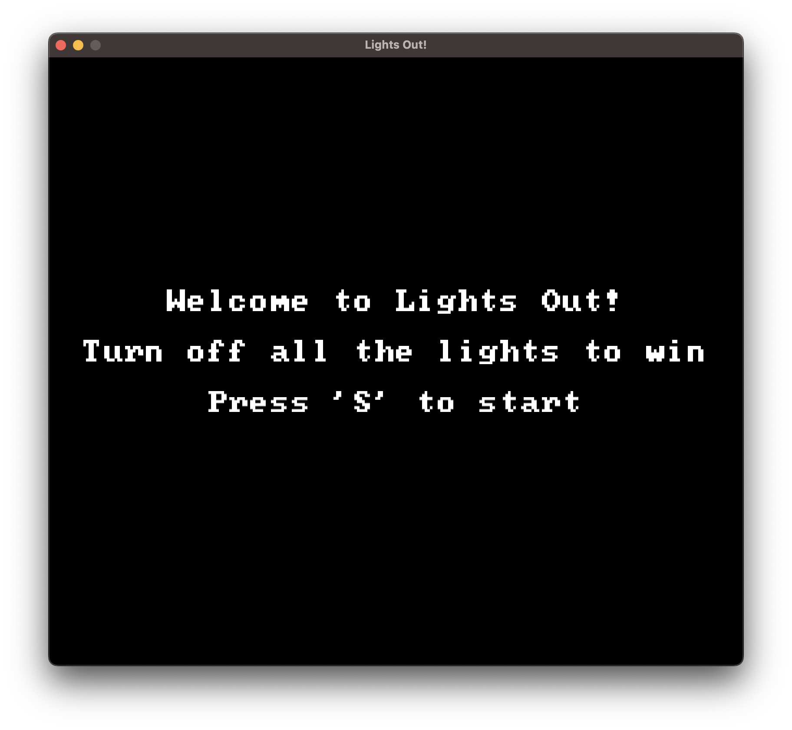
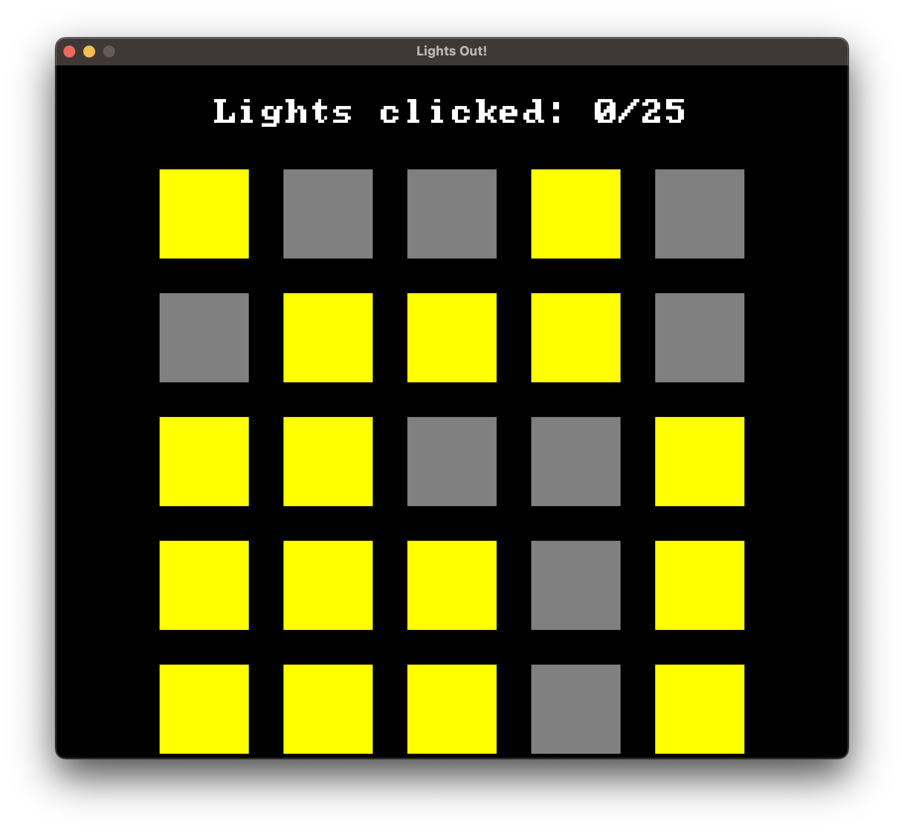
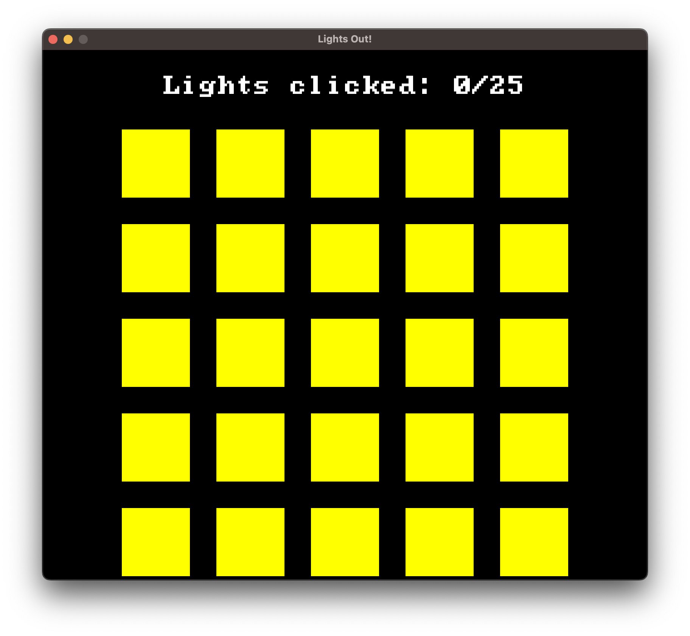
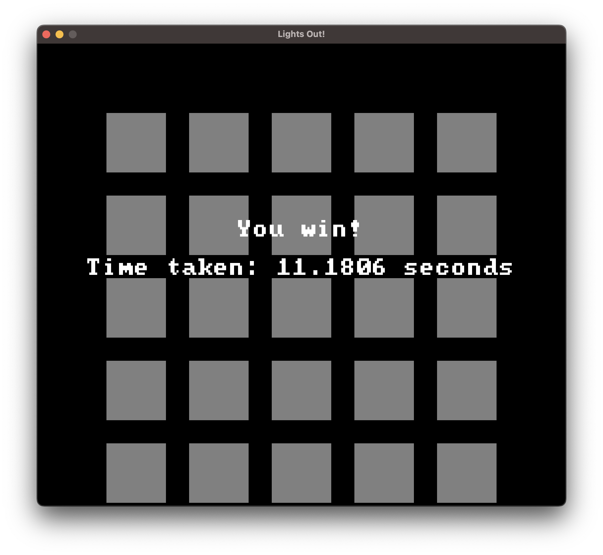

# Lights Out Game
##### Jeff Cooper & Owen Donohoe

---
**NOTE:**
Randomized light configuration may be unsolvable. To remove the randomized start, delete/comment out this segment from the ```initShapes()``` method in **engine.cpp**

```
if (rando)
    color = {.5,.5,.5,1};
```
---

## Summary
This project implements a simple game called "Lights Out" using OpenGL and GLFW in C++. The objective of the game is to turn off all the lights on a grid to win. Clicking on a light toggles its state and affects the neighboring lights. The game provides three states: start, play, and game over, each with different functionalities.

## Screens
### start


### play (random vs not random)
<div style="display: flex;">


</div>

### over


## Language(s) Used
- C++

## Credits
- font, shader, shapes, and original util files provided by Professor Lisa Dion

## Installation
To run this project, you need to have the following installed:
- C++ compiler (supporting C++11 or later)
- GLFW (OpenGL library)
- GLAD (OpenGL loader)

## How to Run
1. Clone the repository to your local machine.
2. Navigate to the project directory.
3. Compile the code using your C++ compiler.

## Game Controls
- Press 'S' to start the game.
- Click on lights to toggle their state.

## Structure
The project consists of the following key components:
- **engine**: Contains the main game engine class responsible for OpenGL initialization, rendering, and game logic.
- **shaders**: Folder containing vertex and fragment shader files for rendering shapes and text.
- **fonts**: Folder containing the font file used for rendering text.

## Gameplay
- **Start Screen**: Displays a welcome message and instructions to start the game by pressing 'S'.
- **Play Screen**: Shows the grid of lights where the player interacts. Clicking on a light toggles its state and affects neighboring lights. Displays the number of lights clicked.
- **Game Over Screen**: Indicates the player has won and displays the time taken to win.

## Added Features
- Starts with a random configuration
- Start screen with the directions written in text
- Keeps track of the number of lights the user clicks and display it on the screen
- Records the amount of time it takes the user to finish the game and print it on the end screen

## Known Issues
- No issues.

## Contact

Jeff Cooper - [Linkedin](https://www.linkedin.com/in/jeff-cooper-677069267/) | [Github](https://github.com/jeffcooper1) | [Email](mailto:jeff.cooper@uvm.edu)

Owen Donohoe - [Github](https://github.com/OwenDonohoe1) | [Email](mailto:owen.donohoe@uvm.edu)